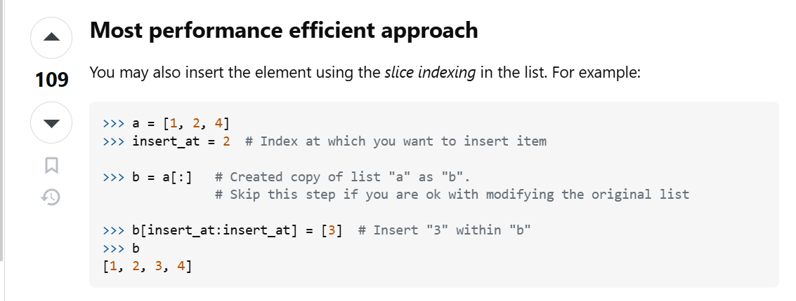

DSA 

Most efficient way to put an element at an index:
https://stackoverflow.com/questions/14494747/how-to-add-images-to-readme-md-on-github


When to use dict of lists and when to use list of lists(you will see this in graphs where you need to create adj lists)

When the keys of the dictionary are 0, 1, ..., n, a list will be faster, since no hashing is involved. As soon as the keys are not such a sequence, you need to use a dict.
https://stackoverflow.com/questions/15990456/list-of-lists-vs-dictionary

when you want to search an element from a list consider using a set too, as search operation in **set** is O(1) as it uses hashtable internally

imo a surprising behavior of .append() with mutable data types
.append actually just creates a reference to the variable that you are passing, if you change that variable then the original result will also have the same changes. Beware of this.
example:
```
num = [1, 2]
res = []
res.append(num)   # res now has a REFERENCE to num
num.clear()       # modifies the same list object
print(res)        # prints [[]], because num changed 
```
To avoid that either do one of the following:
1. use list(num) while appending (it creates a new object instead of referencing back to the same object)
2. use num[:] while appending